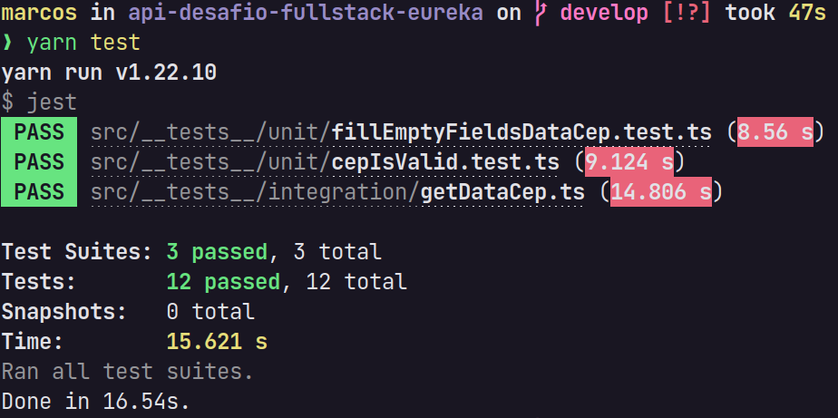

# API

### Tecnologias/Bibliotecas utilizadas na API
- TypeScript
- Express
- Jest
- Axios
- Cors
- Firebase

### Estrutura da API

<h3 id="data-cep">DataCep</h3>
| Field | Type |
|:------ | ---- |
| cep | string |
| logradouro | string |
| complemento | string |
| bairro | string |
| localidade | string |
| uf | string |
| ibge | string |
| gia | string |
| ddd | string |
| siafi | string |

#### Rotas

| Method        | Base URL           | Endpoint  | Response (JSON) | Status Code |
| :------------- |:----------------| :----- | :----- | :----- |
| GET      | https://api-desafio-fullstack-eureka.herokuapp.com | /cep/{cep} | [DataCep](#data-cep) or `{ "erro": true }` | `200`, `201`, `400` or `404` |

#### Exemplos de Requisições

| Method | URL      | Response (JSON) | Status Code | Description |
| :----- | :------- | :------- | :---------- | :---------- |
| GET    | https://api-desafio-fullstack-eureka.herokuapp.com/cep/wewffef | `{ "erro": true }` | 400 | O cep `wewffef` é inválido |
| GET    | https://api-desafio-fullstack-eureka.herokuapp.com/cep/64083080 | `{ "localidade": "Teresina","gia": "Não possui","logradouro": "Conjunto Redonda","ddd": "86","bairro": "Colorado","uf": "PI","siafi": "1219","cep": "64083080","complemento": "Não possui","ibge": "2211001" }` | 201 | Os dados do cep `64083080` não estão presente no banco de dados, então foi realizada sua persistência |
| GET    | https://api-desafio-fullstack-eureka.herokuapp.com/cep/64083080 | `{ ""localidade": "Teresina","gia": "Não possui","logradouro": "Conjunto Redonda","ddd": "86","bairro": "Colorado","uf": "PI","siafi": "1219","cep": "64083080","complemento": "Não possui","ibge": "2211001"" }` | 200 | Os dados do cep `64083080` já estão no banco de dados, então foi realizada a busca através do cep |
| GET    | https://api-desafio-fullstack-eureka.herokuapp.com/cep/12345678 | `{ "erro": true }` | 404 | O cep `12345678` não foi encontrado na API da ViaCEP |

> OBS: O parâmetro `{cep}` tem que ter 8 dígitos (somente números)

### Testes

> Os testes estão no diretório `src/__tests__`. Foram realizados testes unitários e de integração.

